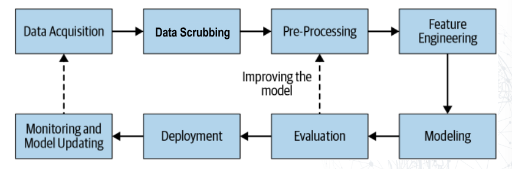
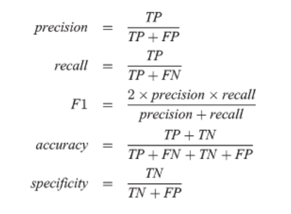

# AI - Kecerdasan Buatan

## Regression, Classification, Clustering (Week 1)

[File Latex Tugas](./Tugas/TK01.tex)

## Data Preperation (Week 2) 

### CRISP-DM Model

Siklus untuk mengatasi masalah data mining yang terdiri dari 6 tahap:

- Business Understanding (Memahami tujuan bisnis dan masalah yang ingin diselesaikan)
- Data Understanding (Memahami data yang digunakan) -> Business Understanding
- Data Preparation
- Modeling (Training Model) -> Data Preparation
- Evaluation (Evaluasi hasil model yang dibuat) -> Business Understanding
- Deployment

#### Business Understanding

Kasus cocok pakai jenis ML apa? (Supervised/Unsupervised) (Classification/Regression/Clustering)

> Halaman 5 [PPT Week2](./Files/Week2.pdf)

### Pipeline

### Data Scrubbing

- Identifikasi data yang hilang
- Menghilangkan outlier
- Memperbaiki format
- Menghilangkan data duplikat
- Menangani data yang tidak konsisten

### Feature Selection

Mengindengtifikasi fitur yang paling penting untuk model, memilih fitur yang paling relevan dan menghilangkan fitur yang tidak relevan.

> Exploratory Data Analysis (EDA): Melihat hubungan antar fitur dan target

### Feat Reduction (Dimensionality Reduction)

Mengurangi jumlah fitur yang ada dengan menggabungkan fitur yang mirip menjadi satu fitur.

> Halaman 16 [PPT Week2](./Files/Week2.pdf)

- Kelebihan: Mengurangi overfitting, meningkatkan kecepatan training
- Kekurangan: Mengurangi informasi terkait fitur yang spesifik

### Row Compression

Jarang digunakan, mengurangi jumlah data dengan menggabungkan beberapa baris data menjadi satu baris data.

> Halaman 18 [PPT Week2](./Files/Week2.pdf)

### One Hot Encoding

Mengubah data kategorikal menjadi data numerik. Contoh:

- Jenis Kelamin: Laki-laki, Perempuan -> 0, 1

#### Bukan One Hot Encoding

- Kota: Jakarta, Bandung, Surabaya -> 0, 1, 2

Jarkarta, jadinya data bernilai 0

#### One Hot Encoding

- Kota Jakarta
- Kota Bandung
- Kota Surabaya

Jarkarta, jadi data berniilai 1 0 0 

- Pros: Beberapa algoritma dioptimasi untuk one hot encoding
- Cons: Menambah dimensi data dan fitur

### Binning

Mengelompokkan data numerik menjadi beberapa kategori. Alasan mengubah dari numerik ke kategori adalah untuk mengurangi noise dan membuat model lebih mudah dipahami, atau kategori lebih merepresentasikan data. Contoh:

- Umur di bawah 18 tahun -> dibawah umur
- Umur di atas 18 tahun -> dewasa

Jika model untuk memprediksi apakah seseorang akan membeli produk, umur lebih relevan jika dibagi menjadi kategori dewasa dan dibawah umur.

### Missing Data

- Data dapat diprediksi dengan menggunakan modus atau median
- Data yang memiliki missing values juga dapat dihapus

## Setting Up Data (Week 2)

### Tipe data

- Training: Mentrain model
- Testing: Mengecek apa model yang dibuat sudah baik atau tidak
- Validation (Opsional)

Ratio data seharusnya 70/30 atau 80/20 untuk training dan testing.

### Cross Validation

Menduplikasi data dengan training dan testing yang beda beda

- Exhaustive: Mencoba setiap kombinasi (jarang dipakai karena terlalu berat)
- K-fold validation: Mengelompokan data menjadi k buah bucket dan mengambil satu bucket sebagai testing dan k-1 bucket sebagai training

### Jumlah data yang diperlukan

Minimum 10 kali jumlah fitur. Data yang diperlukan sebaiknya kombinasi dari seluruh fitur.

### What is a Good Model

- Generalisasi: Model yang baik adalah model yang dapat memprediksi data yang belum pernah dilihat sebelumnya
- Interpretability: Model yang baik adalah model yang mudah dipahami oleh manusia
- Prediction Speed: Model yang baik adalah model yang cepat dalam memprediksi data
- Practicability: Prediksi acceptable saat voulme data besar

### Error

- Training Error: Error yang dihasilkan oleh model saat training
- Testing Error (Generalization Error): Error yang dihasilkan oleh model saat testing

#### Overfitting

Model terlalu baik dalam memprediksi data training, tapi tidak baik dalam memprediksi data testing.

#### Underfitting

Model terlalu buruk dalam memprediksi data training, dan juga tidak baik dalam memprediksi data testing.

#### Bias & Variance

> Halaman 37 [PPT Week2](./Files/Week2.pdf)

### Correctness

- True Positive: Prediksi benar, hasil benar (TP)
- True Negative: Prediksi salah, hasil salah (TN)
- False Positive: Prediksi benar, hasil salah (FP)
- False Negative: Prediksi salah, hasil benar (FN)

#### Classifer metrics

## Regresi (Week 3)

