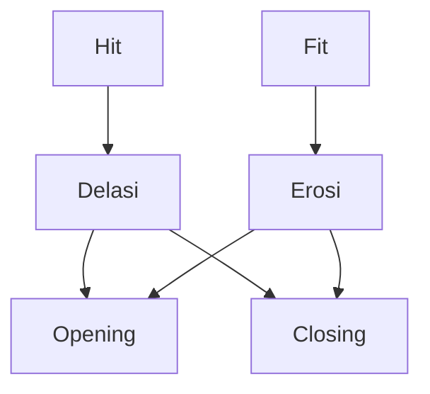

# ML - Pemrosesan Sinyal Multimedia

---

## Inverse Problem (Week b1)

- Mengubah degradasi sinyal menjadi sinyal awal

### Linear Observation Model

$$y = Fx + n$$

- $y$: Observation
- $x$: Latent clear signal estimation
- $F$: Degradasi operator/matrix
- $n$: Noise

Ill-posed problem:

- Ill positioning problem: $F$ tidak invertible, $x$ tidak dapat diestimasi dengan baik

Weakly-posed problem:

- $F$ invertible, tetapi $x$ tidak dapat diestimasi dengan baik
- Kalau Fx = y tidak well-posed, maka ill-posed

## Morphological Image Processing (Week b3)

### Basic Morph Processing

- Level 1
  - Fit: Persis menimpa structuring element pada objek
  - Hit: Ada bagian dari structuring yang menimpa objek
  - Miss: Tidak ada bagian structuring yang menimpa objek
- Level 2
  - Erosi: Menghilangkan bagian dari objek yang tidak terfit
  - Dilasi: Menambah bagian dari objek yang terfit
- Level 3
  - Banyak, contohnya
    - Opening: Erosi diikuti dilatasi: Memisahkan objek
    - Closing: Dilatasi diikuti erosi: Mengisi Hole

> Strel (Structuring element): bentuk yang digunakan untuk memproses citra, anggap sebagai kernel dalam konvolusi

### Main-main himpunan

Reflection

- $$\hat{B} = \{w | w = -b, b \in B\}$$
- $b$ adalah elemen dari $B$, $w$ adalah elemen dari $\hat{B}$

Translation

- $$\hat{B} = \{w | w = b + z, b \in B\}$$

Erosi

- $$A \ominus B = \{z | (B)_z \subseteq A\}$$
- B adalah structuring element, $A$ adalah citra
- B subset dari A

Dilasi

- $$A \oplus B = \{z | (B)_z \cap A^C \neq \emptyset\}$$
- B intersect A tidak kosong
